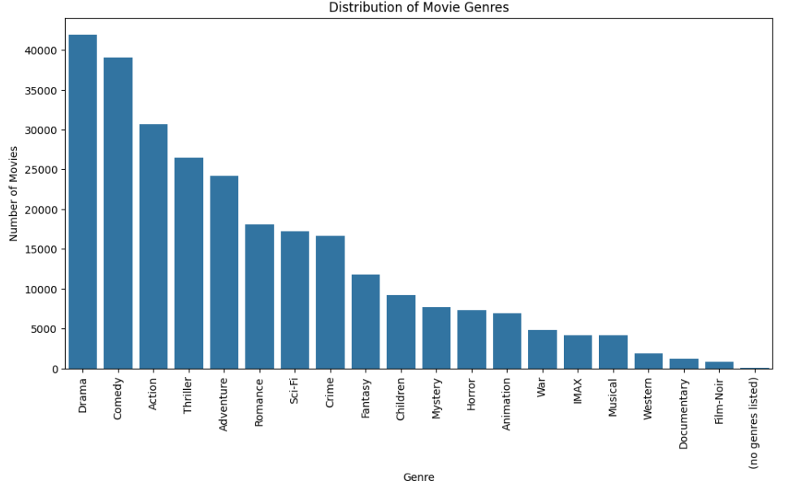
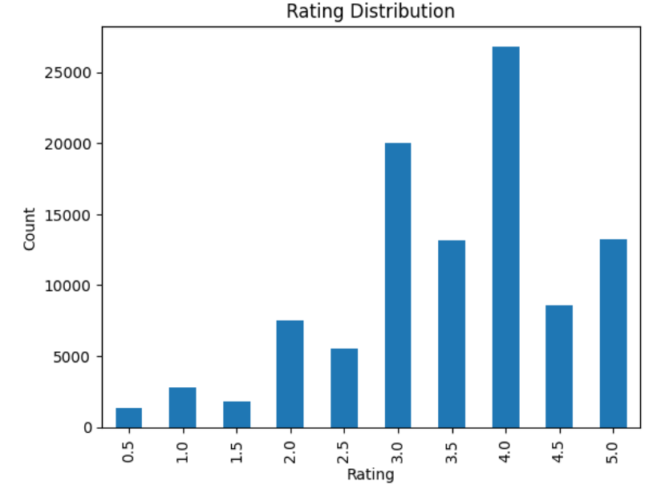
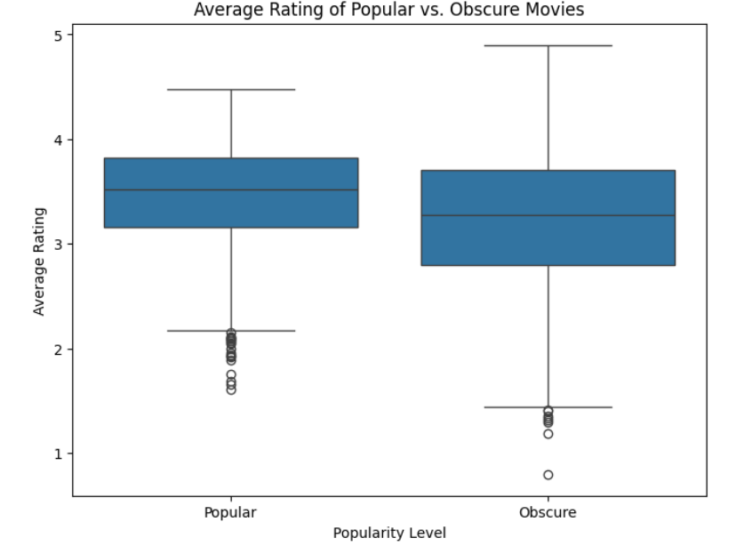
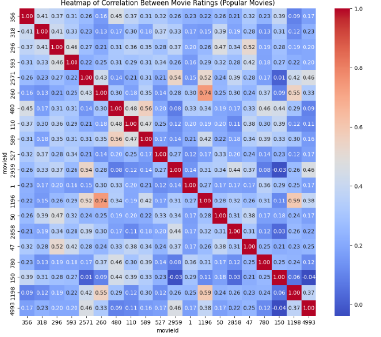

# Movie Recommender System
Delivering personalized content to increase user engagement and retention.

## Overview
With an ever-growing library of content in the movie industry, users often find themselves overwhelmed by the sheer amount of available options, spending excessive time searching rather than watching. This leads to disengagement and increased churn, negatively impacting platform revenue and user retention. This movie recommender system uses a hybrid model of collaborative and content based filtering to suggest personalized content to users.

## Objectives
- Reduce user churn.
- Enhance user engagement.
- Improve content discovery and user satisfaction.

## Dataset overview
The recommender system uses the MovieLens dataset which includes:

- **Movies**: 9,742 entries with titles, genres, release years
- **Ratings**: User-movie interactions on a 5-point scale
- **Tags**: User-generated descriptors
- **Links**: Connections to external movie databases

### Dataset limitations
- Older ratings may not reflect current preferences
- Cold start problem
- Missing contextual info e.g. day, device, mood
- Limited demographic data

## Data insights
- The top 3 genres with the highest number of rated movies are : **Drama**, **Comedy**, **Action**
  
  
  
- Ratings skew positive: users rate movies they enjoy

  
  
- Similar rating patterns between popular and obscure titles

  
  
- Movie preferences tend to form clusters among users

  

## Modelling

### Collaborative Filtering (SVD)
- Uses user behavior to recommend content based on similarities between users
- Matrix Factorization (SVD) decomposes the user-item rating matrix into 100 latent factors to predict ratings for unrated movies
  
#### Example recommendations for user 1
- City of Lost Children
- Shawshank Redemption
- Trainspotting

### Content Based Filtering
- Recommends movies based on similarity of movie features such as genres.
- **TF-IDF** is used to transform genres into numerical features to compute similarity between movies.

#### Example recommendations for Toy Story (1995):
- Antz
- Toy Story 2
- Monsters, Inc.

### Hybrid models
- Combines the strengths of Collaborative Filtering and Content-based filtering
- Provide more accurate and diverse recommendations as well as reducing cold-start issues.

#### Example recommendations for user 1:
- Shawshank Redemption
- In the Name of the Father
- Blade Runner

## Conclusion

### Model evaluation
- **RMSE**: Penalizes large prediction errors that lead to poor recommendations. This is critical since bad recommendations damage user trust.
- **MAE**: Measures average error magnitude for business reporting.
- Our hybrid model achieved a low RMSE (0.8577), which means it predicts ratings accurately, similar to top models like those in the Netflix Prize.
- The MAE (0.6587) shows that our predictions are only off by about 0.66 stars on average making our recommendations highly reliable.

### Next Steps

1. Deploy the system and monitor real user interactions.
2. Explore contextual recommendations by integrating factors such as time, device, mood.
3. Integrate behavior data (rewatch rates, watch duration) for more tailored suggestions.

## Authors
- Brenda Chemutai
- Antony Odhiambo
- Evans Makau
- Christine Kindena
- John Mugambi

## Repository Navigation

```bash
├── data/               # Raw MovieLens dataset files
├── notebooks/          # Jupyter notebooks for data analysis and modeling
├── README.md           # Project overview
├── images/             # Visualizations
└── presentation.pdf    # Final presentation slides
